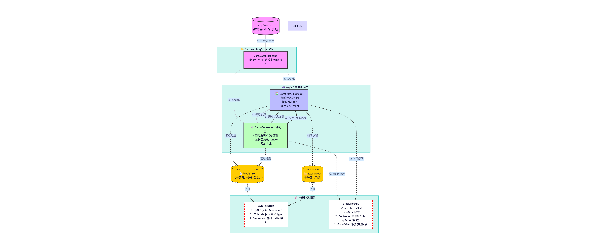

# 需求

1. 需求1：手牌区翻牌替换
    - 点击手牌区♥A，♥A会平移（简单MoveTo）到手牌区的顶部牌（♣4）并替换它作为新的顶部牌
2. 需求2：桌面牌和手牌区顶部牌匹配
    - 点击桌面牌的♦️3，卡牌会和手牌区顶部的♣4进行匹配【桌面牌区的牌只要和手牌区顶部牌点数差1就可以匹配，无花色要求】，点击的桌面牌（♦️3）会平移到手牌区的顶部牌（♣4）并替换它作为新的手牌区的顶部牌
3. 需求3：回退功能
    - 场景：点击♦️3 -> 点击♥A -> 点击♠2 后；连续多次点击 回退按钮 ，各卡牌需要反着平移（简单MoveTo）到原位置；直到无回退记录可回退；

# 开发环境

- **Cocos2dx**:3.17.2
- **Python**:2.7.8
- **Visual Studio 2022**

# 系统架构概述

场景层 (Scene - CardMatching):
职责: 游戏的入口容器，负责初始化导演 (Director)、设置分辨率、创建并组装视图与控制器。
关键逻辑: 在 init() 方法中实例化 GameView 和 GameController 并将它们绑定。

视图层 (View - GameView):
职责: 负责所有视觉元素的渲染（卡牌显示、动画、界面布局）。
数据来源: 从 json 文件中加载关卡配置，接收用户点击事件，并将其委托给控制器处理；接收控制器的指令更新界面。

控制层 (Controller - GameController):
职责: 处理核心游戏逻辑（卡牌匹配规则、状态管理、胜负判定）。通过 gameView->setGameController(gameController) 与视图建立联系。

应用代理 (AppDelegate):
职责: 应用程序的生命周期管理（启动、暂停、恢复），负责设置初始窗口大小并运行 CardMatching 场景。

# 扩展指南

代码中数据（JSON）、视图（GameView）和逻辑（GameController）分离，新增卡牌类型无需修改核心引擎代码，只需遵循以下步骤：
1. 准备图片资源: 将新卡牌的图片文件放入项目的 Resources 目录。
2. 配置数据：在 JSON 配置文件中定义新卡牌的类型标识符。
3. 更新视图逻辑：加载对应图片生成节点。
4. 更新逻辑判断：新卡牌若有特殊的匹配规则需在控制器的匹配验证函数中添加相应逻辑。

目前的代码结构中，回退功能的逻辑应主要存在于 GameController 中，而 GameView 负责表现回退后的状态。使用栈保存游戏谋一时刻的卡牌的状态，要新增一种新类型的回退，只需对该历史栈进行修改即可

- 卡牌种类由 JSON 决定
= GameController 只管状态变化，GameView 只管怎么画。新增回退功能时，只需在 Controller 中改变状态恢复的策略，View 层只需统一调用刷新即可。